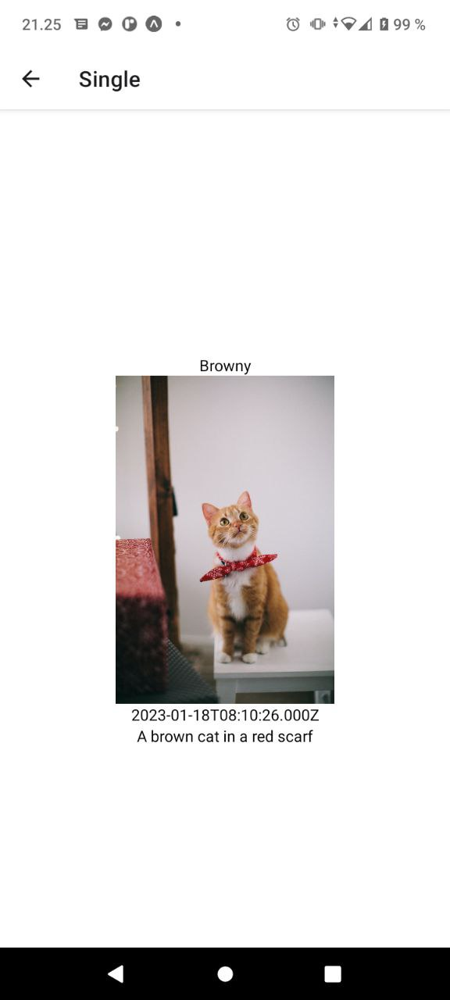

# ExampleApp

An example app using React Native

## Features

- Implement conditional rendering techniques
- Maintain authentication flows using React Navigation
- Utilize the Context API for managing state
- Implement AsyncStorage for storing token data persistently.

## Screenshots

