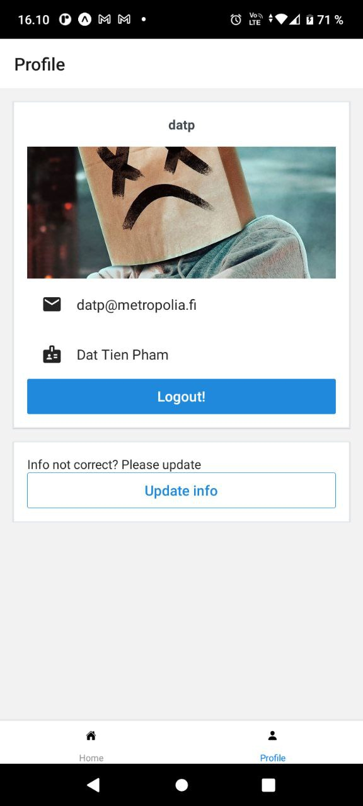

# ExampleApp

An example app using React Native

## Features

- Assign state to control Login/Register page
- Enhance validation rules of React Hook Form
- Add user profile update functionality to profile page

## Screenshots

